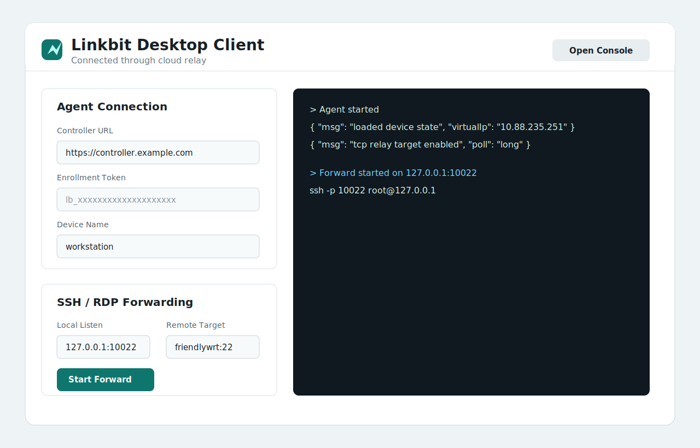
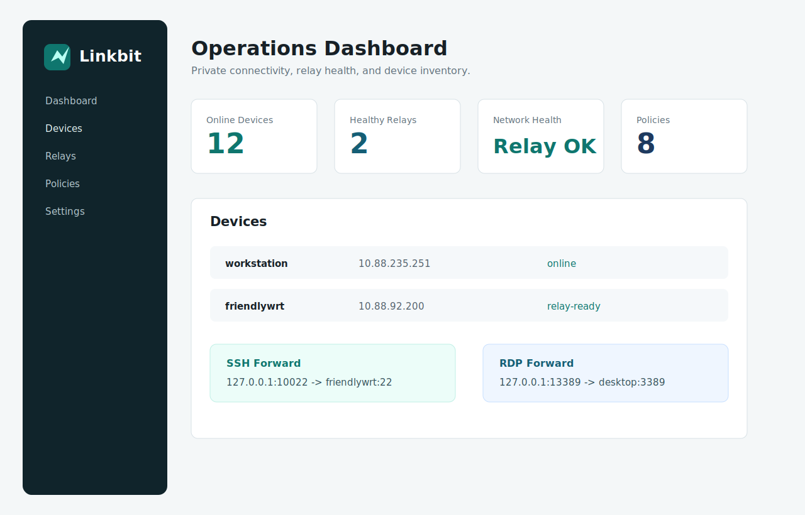

<p align="center">
  
</p>

<h1 align="center">Linkbit</h1>

<p align="center">
  Self-hosted secure networking for low-latency SSH, desktop access, service sharing, and private device operations.
</p>

<p align="center">
  <a href="README.zh-CN.md">中文</a>
  ·
  <a href="docs/deployment.md">Deployment Guide</a>
  ·
  <a href="docs/openapi.yaml">OpenAPI</a>
  ·
  <a href="https://github.com/RobotXTeam/Linkbit/releases">Releases</a>
</p>

<p align="center">
  
  
  
  
  
</p>

---

## What Is Linkbit?

Linkbit is a self-hosted VPN and application integration platform designed for teams, homelabs, and private infrastructure operators who need secure device-to-device communication without handing the control plane to a third party.

It combines a public controller, a relay-capable network hub, endpoint agents, and a web console. Devices enroll with invitation tokens, receive virtual IPs, and can communicate through a cloud server hub when direct connectivity is not available.

## Product Capabilities

- Secure device enrollment with one-time invitation tokens and device-scoped credentials.
- Controller-managed virtual network with WireGuard-based data plane.
- Cloud server hub routing for NAT-heavy environments.
- Web console for devices, users, groups, relays, API keys, policies, and settings.
- Linux endpoint agent with automatic WireGuard identity generation and persistent state.
- Visual desktop client for launching the agent without CLI-only workflows.
- TCP relay forwarding for SSH/RDP-style traffic when UDP is blocked or unstable.
- Release packaging for Linux, macOS, Windows, plus Linux AppImage desktop packaging.
- Real-world validation between a local workstation and an ARM64 OpenWrt/FriendlyWrt target.

## Screenshots

### Desktop Client



### Web Console



## Architecture

```text
┌──────────────────────┐
│  Linkbit Controller  │
│  API · Web · SQLite  │
│  WireGuard Hub       │
└──────────┬───────────┘
           │ Cloud relay path
    ┌──────┴──────┐
    │             │
┌───▼───┐     ┌───▼───┐
│Agent A│     │Agent B│
│10.88.x│     │10.88.x│
└───────┘     └───────┘
```

Core components:

- `linkbit-controller`: authentication, device registry, policy API, relay registry, web console, and optional WireGuard hub.
- `linkbit-relay`: DERP-style relay service with controller registration and heartbeat.
- `linkbit-agent`: endpoint enrollment, WireGuard interface management, TCP relay forwarding, health reporting, and desktop integration boundary.
- `desktop/`: Electron visual client for non-CLI operation.
- `web/`: React + TypeScript management console.

## Verified Status

The current development deployment has been verified with:

- Controller and web console health checks.
- Relay health checks.
- API smoke tests, stress tests, and relay recovery tests.
- WireGuard hub route installation.
- Local workstation to ARM64 target communication through Linkbit TCP relay.
- SSH over Linkbit cloud relay.
- Opportunistic WireGuard virtual IP connectivity when the underlying UDP path is healthy.

Observed Linkbit relay latency in the tested environment:

```text
local workstation -> cloud hub -> ARM64 target
SSH handshake through TCP relay: about 0.29s to 0.84s
target -> cloud server ICMP RTT: about 7 ms
```

Remote desktop depends on the target device running a desktop service such as RDP, VNC, NoMachine, or RustDesk. Linkbit provides the private TCP forwarding path; the desktop protocol service must still be installed on the target OS.

## Quick Start

### 1. Build and test

```bash
make test
make smoke
make stress
make recovery-smoke
```

### 2. Build release packages

```bash
LINKBIT_VERSION=v0.2.0 ./scripts/package-release.sh
```

Artifacts are written to:

```text
artifacts/release/
```

### 3. Run a controller

Create controller configuration from the example:

```bash
cp deploy/controller.env.example /etc/linkbit/controller.env
```

Important production settings:

```env
LINKBIT_LISTEN_ADDR=:80
LINKBIT_PUBLIC_URL=https://controller.example.com
LINKBIT_API_KEY_PEPPER=replace-with-random-secret
LINKBIT_BOOTSTRAP_API_KEY=replace-with-admin-key
LINKBIT_HUB_WG_ENABLED=true
LINKBIT_HUB_WG_INTERFACE=linkbit-hub
LINKBIT_HUB_WG_IP=10.88.0.1
LINKBIT_HUB_WG_NETWORK=10.88.0.0/16
LINKBIT_HUB_WG_PORT=443
LINKBIT_HUB_WG_PRIVATE_KEY=replace-with-wireguard-private-key
LINKBIT_HUB_WG_ENDPOINT=controller.example.com:443
```

Install:

```bash
./deploy/install-controller.sh
./deploy/install-relay.sh
```

### 4. Sign in to the web console

Open the controller URL, for example:

```text
http://120.79.155.227/
```

The `Admin API Key` at the top of the page is not an enrollment token. It is the administrator key used to load devices, relays, policies, and system settings. In production it comes from `LINKBIT_BOOTSTRAP_API_KEY`, or from an admin-created API key.

For the current test deployment, the admin key is stored in the local ignored file:

```bash
cat .tools/remote-bootstrap-key
```

Paste the output into `Admin API Key` and click `Connect`. The console only loads real device, relay, and policy data after that.

### 5. Enrollment tokens and device enrollment

Enrollment tokens are only for a new device's first registration. Devices that are already registered do not keep using their original token; they reconnect with the device ID and device token stored in their local state file.

In the web console, use `Device Invitation` and click `Generate`. The console shows a one-time token and an equivalent command. Then run this on the new device:


```bash
sudo ./linkbit-agent \
  --controller https://controller.example.com \
  --enrollment-key <token> \
  --name laptop \
  --interface linkbit0
```

For visual operation, use the Linkbit desktop client AppImage and enter the same controller URL and enrollment token.

The current FriendlyWrt target is already registered as `friendlywrt`, with virtual IP `10.88.92.200`, so it does not need a new enrollment token. Access it through desktop forwarding:

```text
Local Listen: 127.0.0.1:10022
Remote Target: friendlywrt:22
```

## How To Use The Desktop Client

### Connect a device

1. Open the Linkbit desktop client.
2. Fill `Controller URL`, for example `https://controller.example.com` or `http://192.0.2.10`.
3. Paste the enrollment token generated from the web console.
4. Set a readable device name, for example `workstation` or `friendlywrt`.
5. Keep the interface name as `linkbit0` unless you need a custom interface.
6. Click `Start Agent`.

Creating a WireGuard interface on Linux requires administrator/root permission. If the system Agent is already installed, the normal desktop client does not need to start the Agent again; use SSH/RDP forwarding directly.

When the log shows `device registered`, `loaded device state`, or `tcp relay target enabled`, the device is ready.

### Open the management console

Click `Open Console` in the top-right corner of the desktop client. If the controller URL has no scheme, the client automatically opens it as `http://...`.

### Forward SSH through Linkbit

Use the forwarding panel:

```text
Local Listen: 127.0.0.1:10022
Remote Target: friendlywrt:22
```

Then connect from the local machine:

```bash
ssh -p 10022 root@127.0.0.1
```

If the app says `address already in use`, `127.0.0.1:10022` already has a forward or another service listening. Try the SSH command above directly, or change `Local Listen` to `127.0.0.1:10023`.

You can also target a virtual IP:

```text
Remote Target: 10.88.92.200:22
```

### Forward RDP through Linkbit

If the remote Windows or Linux desktop has RDP listening on `3389`, use:

```text
Local Listen: 127.0.0.1:13389
Remote Target: desktop-device:3389
```

Then open your RDP client and connect to:

```text
127.0.0.1:13389
```

### Control a friend's computer

The complete flow is:

1. Open the web console, paste the `Admin API Key`, and click `Connect`.
2. In `Device Invitation`, click `Generate`, then copy the enrollment token or generated command.
3. Send the Linkbit client installer, controller URL, and enrollment token to your friend.
4. Your friend installs Linkbit, starts the Agent with administrator/root permission, and enters:

```text
Controller URL: http://120.79.155.227
Enrollment Token: token generated by the web console
Device Name: friend-pc
```

5. After `friend-pc` appears in the console, start a forward on your computer:

```text
Local Listen: 127.0.0.1:13389
Remote Target: friend-pc:3389
```

6. Open your remote desktop client and connect to:

```text
127.0.0.1:13389
```

Linkbit provides the private cloud relay path between your computer and your friend's computer. The friend's computer must still run a desktop service. On Windows, enable RDP. On Linux, install `xrdp`, VNC, or NoMachine. If no desktop service is running on the friend's computer, installing Linkbit alone is not enough to see the screen.

### CLI equivalent

The desktop forwarding action is equivalent to:

```bash
linkbit-agent forward \
  --controller https://controller.example.com \
  --state ~/.config/linkbit/agent-state.json \
  --listen 127.0.0.1:10022 \
  --target friendlywrt:22
```

## Repository Layout

```text
cmd/                    Go binary entrypoints
internal/controller/    Controller API and WireGuard hub
internal/agent/         Agent, WireGuard manager, state, health
internal/relay/         Relay node runtime
internal/store/         SQLite storage adapter
web/                    React management console
desktop/                Electron desktop client
deploy/                 Systemd install scripts and env examples
scripts/                Build, test, packaging, and deployment helpers
docs/                   Architecture, API, packaging, deployment notes
assets/                 Branding assets
```

## Security Model

- API keys and enrollment tokens are generated from cryptographically secure random bytes.
- Tokens are stored as HMAC-SHA256 digests, never plaintext.
- Device credentials are scoped to device APIs only.
- The controller can reject malformed WireGuard endpoints before distributing network config.
- Production deployments should use HTTPS for the controller and restrict admin API key access.
- Runtime secrets are loaded from environment files and excluded from Git.

## Roadmap

- Signed Windows MSI and macOS DMG desktop installers.
- Tray status icon and native service management.
- More relay observability and automatic WireGuard recovery when UDP is degraded.
- RustDesk packaging and deep Linkbit identity integration.
- Multi-tenant RBAC and audit logs.
- High availability controller and external PostgreSQL backend.

## Commercial Positioning

Linkbit is intended to become a polished, self-hosted alternative for secure operations teams that need:

- Private infrastructure access without exposing SSH/RDP to the public internet.
- Predictable cloud-server relay behavior.
- Low operational overhead for adding devices.
- A control plane that can be owned, inspected, and deployed anywhere.

## License

License is not finalized yet. Add a project license before public commercial distribution.
